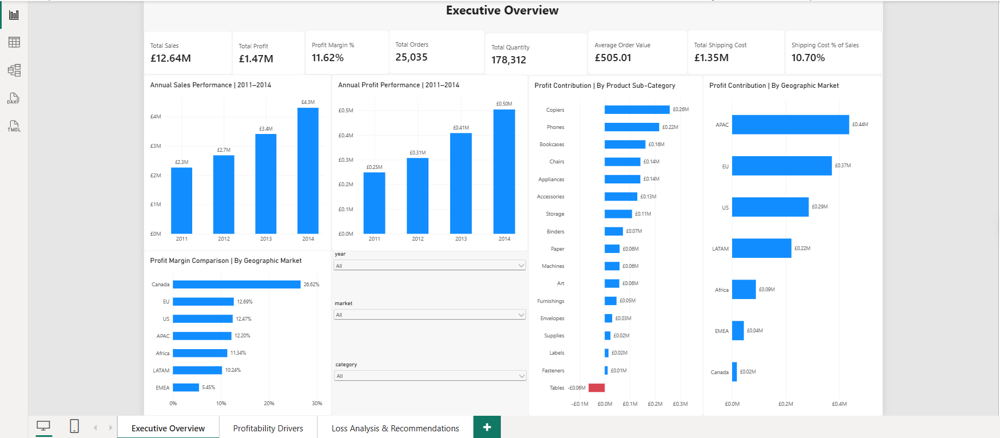
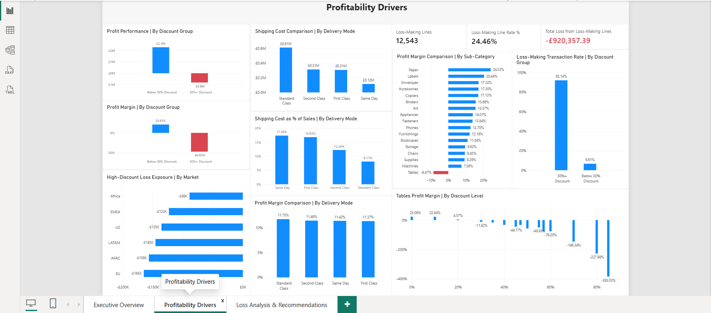
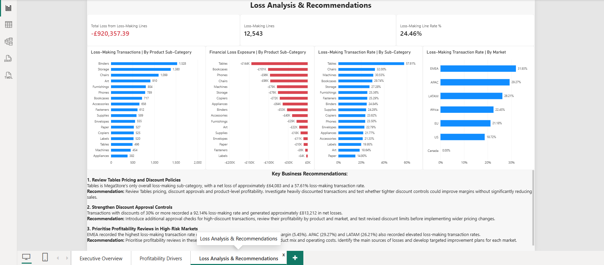

# MegaStore Commercial Performance & Profitability Analysis

### End-to-End Data Analytics Portfolio Project | Python • MySQL • Power BI

## Project Overview

This project investigates MegaStore's sales performance, profitability, discounting practices, shipping costs, and loss-making transactions.

The objective is to identify where the business generates profitable growth, where margins are under pressure, and which commercial improvements could strengthen profitability.

The analysis combines **Python for data cleaning and exploratory analysis, MySQL for business-focused SQL queries, and Power BI for interactive reporting and decision support**.

## Business Problem

Although MegaStore generates substantial sales revenue, not every product, market, or transaction contributes positively to profitability.

This project addresses five business questions:

1. How have sales, profits, and profit margins changed over time?
2. Which products, categories, and geographic markets contribute most to profitability?
3. How are discount levels associated with financial losses?
4. How do shipping costs vary across delivery methods?
5. Which commercial actions should management investigate to improve profitability?

## Dataset Overview

| Metric | Value |
|---|---|
| Transaction lines | 51,290 |
| Unique orders | 25,035 |
| Columns | 21 |
| Reporting period | 2011–2014 |
| Total sales | £12,642,905 |
| Total profit | £1,469,034.82 |
| Overall profit margin | 11.62% |
| Units sold | 178,312 |

*Monetary values are displayed in pounds sterling for reporting consistency; the original dataset's currency has not been independently verified.*

**Dataset availability:** This project uses a 51,290-row Superstore-style sales dataset covering 2011–2014. The dataset was obtained from Kaggle, but the exact original dataset listing and redistribution permissions have not been independently verified. The CSV is therefore not included in this repository.

## Tools and Technologies

- **Python:** Pandas, NumPy, Matplotlib — data preparation, validation, exploratory analysis, and business insights.
- **MySQL:** SQL aggregation, filtering, grouping, profitability calculations, and business investigations.
- **Power BI:** DAX measures, interactive dashboards, KPI reporting, profitability analysis, and recommendations.
- **GitHub:** Project documentation and portfolio presentation.

## Analytical Approach

### 1. Data Cleaning and Validation — Python

- Imported and inspected the transaction dataset.
- Converted date fields into appropriate datetime formats.
- Cleaned sales values containing thousands separators and converted them to numeric values.
- Checked missing values, duplicates, and data types.
- Validated overall sales, profit, quantity, and unique order totals.

### 2. Business Analysis — MySQL

Used SQL to investigate:

- Annual sales and profitability trends.
- Product category and sub-category performance.
- Geographic market profitability.
- Discount levels and loss-making transactions.
- Shipping costs and delivery methods.
- Product- and order-level financial loss exposure.

SQL findings were cross-checked against Python results.

### 3. Dashboard Development — Power BI

Developed a three-page interactive Power BI report:

**Page 1 — Executive Overview**

Presents headline KPIs, annual sales and profit trends, product contribution, and geographic performance.

**Page 2 — Profitability Drivers**

Examines discount groups, shipping costs, delivery modes, sub-category margins, and transaction loss rates.

**Page 3 — Loss Analysis & Recommendations**

Highlights loss-making transaction volumes, financial loss exposure, high-risk product sub-categories, geographic markets, and recommended commercial actions.

## Key Findings

### 1. Strong Sales Growth with Margin Pressure

Sales increased from approximately **£2.26 million in 2011** to **£4.30 million in 2014**.

Profit also increased, reaching approximately **£504,166 in 2014**.

However, profit margin declined slightly from **11.99% in 2013** to **11.72% in 2014**, suggesting that revenue growth did not consistently translate into improved margin efficiency.

### 2. Tables Was the Only Overall Loss-Making Sub-Category

The Tables sub-category generated:

- Sales: **£757,034**
- Net profit: **-£64,083**
- Profit margin: **-8.47%**
- Loss-making transaction rate: **57.61%**

This makes Tables a priority for further investigation into pricing, discounts, product mix, and costs.

### 3. Higher Discounts Were Strongly Associated with Losses

Transactions with discounts of **30% or more** generated:

- Sales: **£1.74 million**
- Net profit: **-£813,212**
- Profit margin: **-46.83%**
- Loss-making transaction rate: **92.14%**

Transactions below 30% discount generated approximately **£2.28 million in profit**, with a **20.93% profit margin**.

These findings show a strong association between high discounting and financial losses, but do not establish that discounts alone caused those losses.

### 4. Significant Loss-Making Transaction Exposure

Across the dataset:

- **12,543** transaction lines were loss-making.
- These represented **24.46%** of all transaction lines.
- Combined negative profit on those lines was approximately **£920,357**.

This identifies an important opportunity for targeted transaction-level profitability reviews.

### 5. Profitability Varied Across Markets

**EMEA** recorded a **5.45% profit margin** and a **31.93% loss-making transaction rate**, making it a priority for investigation.

**APAC** generated the highest overall market profit at approximately **£437,578**, but also had a relatively high loss-making transaction rate of **29.27%**.

**Canada** achieved a **26.62% margin**, although its sales volume was much smaller than that of the major markets.

### 6. Shipping Cost Intensity Varied by Delivery Mode

Shipping cost as a percentage of sales was:

| Delivery Mode | Shipping Cost / Sales |
|---|---:|
| Standard Class | 8.11% |
| Second Class | 12.24% |
| First Class | 16.83% |
| Same Day | 17.38% |

Faster delivery methods had higher shipping cost intensity, while observed profit margins were relatively similar across delivery modes.

## Business Recommendations

**1. Review Tables Pricing and Discount Policies**

Investigate loss-making Tables products, evaluate discount approval practices, and test changes to improve profitability.

**2. Strengthen Discount Approval Controls**

Review transactions with discounts of 30% or more, identify commercial exceptions, and test whether tighter discount governance improves financial outcomes.

**3. Prioritise High-Risk Market Reviews**

Investigate EMEA, APAC, and LATAM, focusing on product mix, discount patterns, operating costs, and loss-making transaction exposure.

**4. Monitor Shipping Cost Efficiency**

Evaluate shipping cost intensity across delivery modes while considering customer service requirements and actual profitability.

## Power BI Dashboard

### Executive Overview



### Profitability Drivers



### Loss Analysis & Recommendations



*Dashboard image links should match the actual filenames in the images folder.*

## Project Structure

```text
MegaStore-Commercial-Performance-Analysis/
├── data/
├── notebooks/
├── sql/
│   └── megastore_analysis.sql
├── powerbi/
│   └── MegaStore_Commercial_Performance.pbix
├── images/
└── README.md
```

## Conclusion

MegaStore demonstrated strong revenue and profit growth over the reporting period, but the analysis revealed significant profitability challenges linked to particular products, discount groups, and markets.

The most important opportunities are to investigate loss-making Tables transactions, strengthen discount governance, and prioritise commercial reviews in markets with high loss exposure.

This project demonstrates an end-to-end analytics workflow, combining data preparation, SQL analysis, KPI development, dashboard design, and actionable business recommendations.
